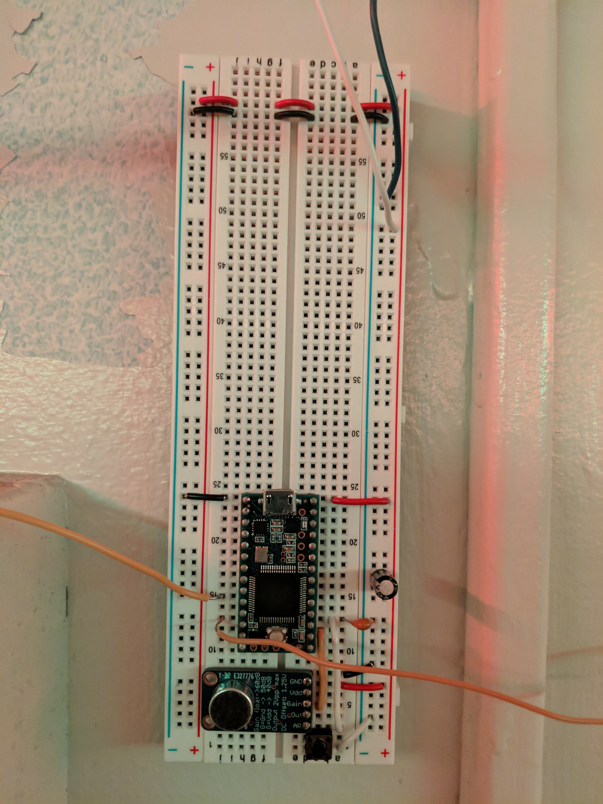

# Spectrum Reactive LED Strips!
##  FFT based music visualization

Base things to do : Create some wiring diagrams, explain hardware and hardware things like A/R to Vdd, explain base premisis of code, key functions etc

```
_swoosh_
```

## Basic Wiring


Cool explanations of why we have to use FreqBinGen and why we SHOULD add some sort of EQ to the processing.
https://www.audiocheck.net/soundtests_nonlinear.php
